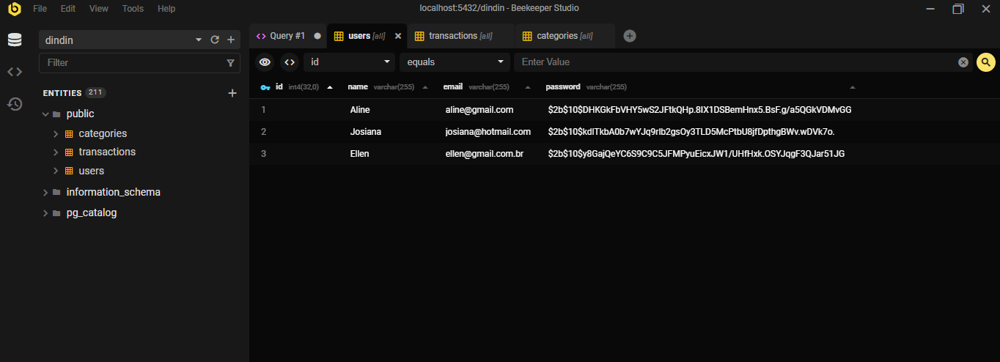
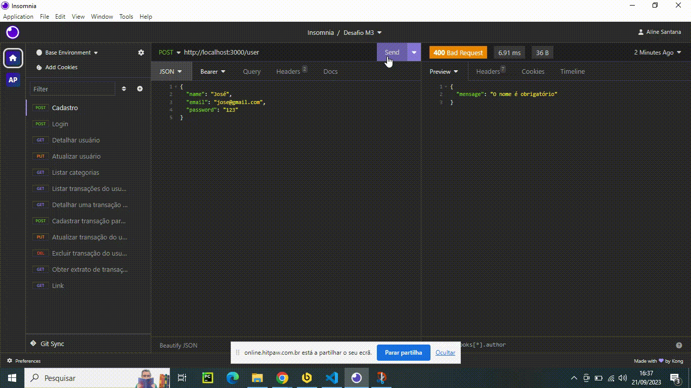

# Desafio Módulo 3 - Backend

O projeto é um RESTful API de controle financeiro pessoal, em que o usuário pode fazer o seu cadastro e controlar os gastos e ganhos que teve. 

### Funcionalidades

- Cadastrar Usuário
- Fazer Login
- Detalhar Perfil do Usuário Logado
- Editar Perfil do Usuário Logado
- Listar categorias
- Listar transações
- Detalhar transação
- Cadastrar transação
- Editar transação
- Remover transação
- Obter extrato de transações
- Filtrar transações por categoria

**Cada usuário só pode ver e manipular seus próprios dados e suas próprias transações.**

## **Banco de dados**


#### Tabelas 

- users

| id | name | email (campo único) | password |
| ---| ---- | ------------------- | ----- |

- categories

| id | descricao | 
| -- | --------- | 

- transactions

| id | descricao | valor | date | category_id | user_id | type |
| ---| --------- | ----- | ---- | ------------ | ---------- | ---- |


## **Categorias**

- Alimentação
- Assinaturas e Serviços
- Casa
- Mercado
- Cuidados Pessoais
- Educação
- Família
- Lazer
- Pets
- Presentes
- Roupas
- Saúde
- Transporte
- Salário
- Vendas
- Outras receitas
- Outras despesas

- Qualquer valor monetário deverá ser inserido em centavos.

## **Endpoints**

### **Cadastrar usuário**

#### `POST` `/user`

Essa rota serve para cadastrar um novo usuario no sistema.

- **Requisição**   
  O corpo (body) deve possuir um objeto com as seguintes propriedades (respeitando estes nomes):
  - name
  - email
  - password

### **Login do usuário**

#### `POST` `/login`

Essa rota permite que o usuario cadastrado realizar o login no sistema.

- **Requisição**  
  - email
  - password
---

### :lock: **ATENÇÃO**: Todas as funcionalidades (endpoints) a seguir, deverão receber o token de autenticação do usuário logado, recebendo no header com o formato Bearer Token, para poder acessar as rotas. 

### **Detalhar usuário**

#### `GET` `/user`

Com essa rota o usuario obtém os dados do seu próprio perfil.  

### **Atualizar usuário**

#### `PUT` `/user`

Essa rota realiza alterações no cadastro do usuário logado.  

- **Requisição**   
  O corpo (body) deverá possuir um objeto com as seguintes propriedades (respeitando estes nomes):
  - name
  - email
  - password

### **Listar categorias**

#### `GET` `/categories`

Essa é a rota que será chamada quando o usuario logado quiser listar todas as categorias cadastradas.

### **Listar transações do usuário logado**

#### `GET` `/transactions`

Essa é a rota que será chamada quando o usuario logado quiser listar todas as suas transações cadastradas.  

### **Detalhar uma transação do usuário logado**

#### `GET` `/transaction/:id`

Essa é a rota que será chamada quando o usuario logado quiser obter uma das suas transações cadastradas.  

### **Cadastrar transação para o usuário logado**

#### `POST` `/transaction`

Nessa rota se cadastra uma transação associada ao usuário logado.  

- **Requisição**  
  O corpo (body) da requisição deverá possuir um objeto com as seguintes propriedades (respeitando estes nomes):
  - descricao
  - valor
  - data
  - categoria_id
  - tipo (campo que será informado se a transação corresponde a uma saída ou entrada de valores)

### **Atualizar transação do usuário logado**

#### `PUT` `/transaction/:id`

Essa rota é utilizada quando o usuário logado quiser atualizar uma das suas transações cadastradas.  

- **Requisição**  
  O corpo (body) da requisição deverá possuir um objeto com as seguintes propriedades (respeitando estes nomes):
  - descricao
  - valor
  - data
  - categoria_id
  - tipo (campo que será informado se a transação corresponde a uma saída ou entrada de valores)

### **Excluir transação do usuário logado**

#### `DELETE` `/transaction/:id`

Essa rota serve para o usuario logado excluir uma das suas transações cadastradas.  

### **Obter extrato de transações**

#### `GET` `/transaction/extract`

Nessa rota é possivél ver o extrato de todas as transações cadastradas do usuário logado, ou seja, uma resposta num objeto contendo a soma de todas as transações do tipo `entrada` e a soma de todas as transações do tipo `saida`.  

### **Filtrar transações por categoria**

#### `GET` `/transactions?filter=nomeDaCategoria`

Consulta apenas transações das categorias informadas.



## :computer: Comandos para rodar o projeto
```bash
git clone link
```
```bash
cd desafio-backend-m02-b2bt05
```
```bash
npm install
```
```bash
npm run dev
```
O servidor inciará na porta:3000 - para isso acesse:
```bash
http://localhost:3000
```


## 🛠 Tecnologias

As seguintes ferramentas foram usadas na construção do projeto:

     


## Autoras

- Aline Santana
- Daphne Vilhar

###### tags: `back-end` `módulo 3` `nodeJS` `PostgreSQL` `API REST` `desafio`
